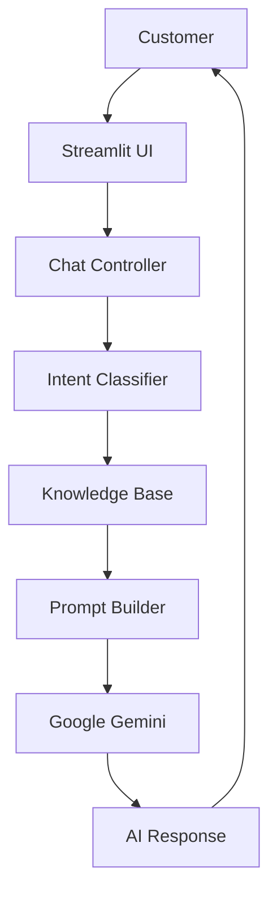

# 🤖 AI Customer Support Assistant

<p align="center">


</p>

---

# 📖 Overview

**AI Customer Support Assistant** is an intelligent customer support chatbot built using **Python**, **LangChain**, **Google Gemini**, and **Streamlit**.

The application provides an interactive ChatGPT-style interface where users can ask customer support questions. It automatically detects the user's intent, retrieves relevant information from a predefined knowledge base, and generates professional responses using Google's Gemini Large Language Model.

This project demonstrates practical implementation of **Generative AI**, **Prompt Engineering**, **LLM Integration**, **Intent Classification**, and **Knowledge-Based Question Answering** in a modular software architecture.

---

# ✨ Features

| Feature                  | Description                                                      |
| ------------------------ | ---------------------------------------------------------------- |
| 🤖 AI-Powered Support    | Responds to customer queries using Google Gemini                 |
| 🧠 Intent Classification | Detects customer intent automatically                            |
| 📚 Knowledge Base        | Retrieves predefined company information                         |
| 🔗 LangChain Integration | Uses LangChain prompt templates and message handling             |
| 💬 Conversation Memory   | Maintains conversation during the session                        |
| 🎨 Modern UI             | Streamlit interface inspired by modern AI chat applications      |
| ⚡ Fast Responses         | Optimized workflow for quick answers                             |
| 🔒 Secure API Keys       | Uses `.env` for API credentials                                  |
| 🧩 Modular Architecture  | Organized into reusable Python modules                           |
| ⚠️ Error Handling        | Handles invalid inputs, API errors, and missing files gracefully |

---

# 🛠 Technologies Used

| Technology             | Purpose                         |
| ---------------------- | ------------------------------- |
| Python                 | Programming Language            |
| Streamlit              | Web Application Framework       |
| LangChain              | LLM Framework                   |
| Google Gemini          | Large Language Model            |
| google-genai           | Gemini SDK                      |
| langchain-google-genai | LangChain Integration           |
| python-dotenv          | Environment Variable Management |
| JSON                   | Knowledge Base Storage          |
| Git                    | Version Control                 |
| GitHub                 | Repository Hosting              |

---

# 📂 Project Structure

```text
AI-Customer-Support-Assistant/
│
├── knowledge/
│   └── customer_data.json
│
├── app.py
├── main.py
├── chat.py
├── llm.py
├── intent_classifier.py
├── knowledge_base.py
├── prompts.py
│
├── screenshots/
│
├── README.md
├── requirements.txt
├── .gitignore
├── .env.example
└── venv/
```

---

# 📁 File Explanation

| File                 | Purpose                                        |
| -------------------- | ---------------------------------------------- |
| app.py               | Streamlit web interface                        |
| main.py              | Optional launcher script                       |
| chat.py              | Connects all backend components                |
| llm.py               | Handles Google Gemini communication            |
| prompts.py           | Stores LangChain prompt templates              |
| knowledge_base.py    | Loads and retrieves knowledge base information |
| intent_classifier.py | Detects user intent                            |
| customer_data.json   | Stores support information                     |
| requirements.txt     | Python dependencies                            |
| .env.example         | Sample environment variables                   |
| .gitignore           | Files ignored by Git                           |

---

# 🏗 System Architecture



---

# ⚙️ Installation

## Clone Repository

```bash
git clone https://github.com/YOUR_USERNAME/AI-Customer-Support-Assistant.git

cd AI-Customer-Support-Assistant
```

---

## Create Virtual Environment

### Windows

```bash
python -m venv venv
```

---

## Activate Environment

### Windows

```bash
venv\Scripts\activate
```

---

## Install Dependencies

```bash
pip install -r requirements.txt
```

---

## Configure Environment Variables

Create a `.env` file.

```env
GOOGLE_API_KEY=YOUR_GOOGLE_API_KEY
```

---

# ▶️ Run the Application

Using launcher:

```bash
python main.py
```

or directly:

```bash
streamlit run app.py
```

---

# 💻 Example Usage

### Product Inquiry

**User**

```
Do you have wireless headphones?
```

**Assistant**

```
Yes, we offer multiple wireless headphone models. Please check our product catalog for available options.
```

---

### Order Status

**User**

```
Where is my order?
```

**Assistant**

```
Please provide your Order ID so I can guide you with the tracking process.
```

---

### Refund Request

**User**

```
I want a refund.
```

**Assistant**

```
Refund requests can be initiated within the eligible return period. Please share your Order ID for further assistance.
```

---

# 📷 Screenshots

```
screenshots/

home.png

chat.png

response.png

---

# 🚀 Future Improvements

The current implementation demonstrates a modular AI-powered customer support assistant. Future enhancements can make it more scalable, intelligent, and production-ready.

| Planned Feature                         | Description                                                                            |
| --------------------------------------- | -------------------------------------------------------------------------------------- |
| 🎤 Voice Assistant                      | Support voice-based customer interactions using Speech-to-Text and Text-to-Speech.     |
| 🧠 RAG (Retrieval-Augmented Generation) | Retrieve answers from documents instead of relying only on a JSON knowledge base.      |
| 🗄 Database Integration                 | Store customer information, orders, and chat history in MySQL, PostgreSQL, or MongoDB. |
| 🔍 Vector Database                      | Integrate FAISS, ChromaDB, or Pinecone for semantic search.                            |
| 🌍 Multi-language Support               | Enable conversations in multiple languages.                                            |
| 👤 User Authentication                  | Secure login system with user profiles.                                                |
| 📊 Admin Dashboard                      | Monitor conversations, analytics, and customer interactions.                           |
| 📈 Analytics                            | Track frequently asked questions and chatbot performance.                              |
| 🐳 Docker Deployment                    | Containerize the application for easier deployment.                                    |
| ⚡ FastAPI Backend                       | Replace the local backend with REST APIs for scalability.                              |
| ☁ Cloud Deployment                      | Deploy on Streamlit Cloud, Render, Railway, AWS, Azure, or Google Cloud.               |

---

# 🎯 Learning Outcomes

By building this project, a developer gains practical experience with:

* Building AI-powered applications using Python.
* Integrating Google Gemini with LangChain.
* Prompt engineering and structured prompts.
* Intent classification using keyword-based logic.
* Designing a modular software architecture.
* Managing API keys securely with `.env`.
* Creating responsive web applications using Streamlit.
* Working with JSON as a lightweight knowledge base.
* Handling API errors and exceptions gracefully.
* Organizing projects using Git and GitHub.

---

# 🛠 Troubleshooting

| Problem                 | Possible Solution                                             |
| ----------------------- | ------------------------------------------------------------- |
| Invalid API Key         | Verify `GOOGLE_API_KEY` in the `.env` file.                   |
| ModuleNotFoundError     | Run `pip install -r requirements.txt`.                        |
| Streamlit not found     | Install Streamlit using `pip install streamlit`.              |
| JSON Decode Error       | Validate the syntax of `customer_data.json`.                  |
| Permission Denied       | Ensure files are not open in another application.             |
| API Quota Exceeded      | Wait for quota reset or use another API key.                  |
| Blank Responses         | Verify that the knowledge base contains relevant information. |
| Application Won't Start | Activate the virtual environment before running.              |

---

# ❓ Frequently Asked Questions

### 1. Which LLM is used?

Google Gemini.

---

### 2. Which framework is used?

LangChain.

---

### 3. Is this a web application?

Yes, it uses Streamlit.

---

### 4. Does it require an internet connection?

Yes, because Gemini is a cloud-based model.

---

### 5. Where is customer information stored?

Inside `knowledge/customer_data.json`.

---

### 6. Can I replace Gemini with OpenAI?

Yes. Replace the LLM implementation in `llm.py`.

---

### 7. Can I add more intents?

Yes. Update `intent_classifier.py` and expand the knowledge base.

---

### 8. Can I connect a database?

Yes. The JSON knowledge base can be replaced with a database such as MySQL, PostgreSQL, or MongoDB.

---

### 9. Is conversation history permanent?

No. It is maintained only for the current application session.

---

### 10. Can this project be deployed online?

Yes. It can be deployed on Streamlit Community Cloud, Render, Railway, AWS, Azure, or Google Cloud.

---

# 🤝 Contributing

Contributions are welcome.

If you would like to improve this project:

1. Fork the repository.
2. Create a feature branch.
3. Commit your changes.
4. Push the branch.
5. Open a Pull Request.

Please ensure that your code is well documented and tested before submitting.

---

# 📄 License

This project is licensed under the **MIT License**.

You are free to use, modify, and distribute this project in accordance with the license terms.

---

# 🙏 Acknowledgements

Special thanks to:

* Google Gemini
* LangChain
* Streamlit
* Python Community
* Open Source Contributors
* Vijesha IT Services LLP (Internship Program)

---

# 👨‍💻 About the Developer

## Nikhil Kanbarkar

**Bachelor of Engineering (Electronics and Communication Engineering)**

### Career Interests

* Artificial Intelligence
* Machine Learning
* Data Science

### Connect with Me

**GitHub:** https://github.com/nikhilkanbarkar

**LinkedIn:** https://linkedin.com/in/nikhil-kanbarkar

**Email:** nikhilkanbarkar101.gmail.com(mailto:your_email@example.com)

---

## Professional Summary

I am an engineering student with a strong interest in Artificial Intelligence, Machine Learning, and Data Science. I enjoy building practical AI applications that solve real-world problems while continuously expanding my knowledge of modern technologies and software development practices.

This project reflects my learning journey in integrating Large Language Models with modern Python frameworks to create intelligent customer support solutions.

---

# ⭐ Support the Project

If you found this project helpful:

* ⭐ Star this repository.
* 🍴 Fork it.
* 🛠 Suggest improvements by opening an issue.
* 🤝 Share it with others.

Your support motivates further development and improvements.

---

<p align="center">

**Made with ❤️ using Python, LangChain, Google Gemini, and Streamlit**

</p>
